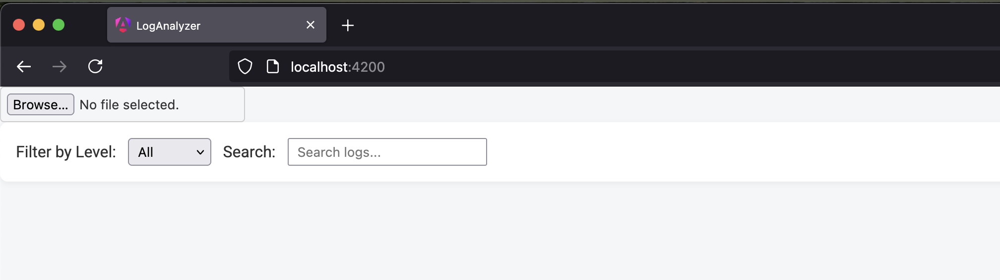
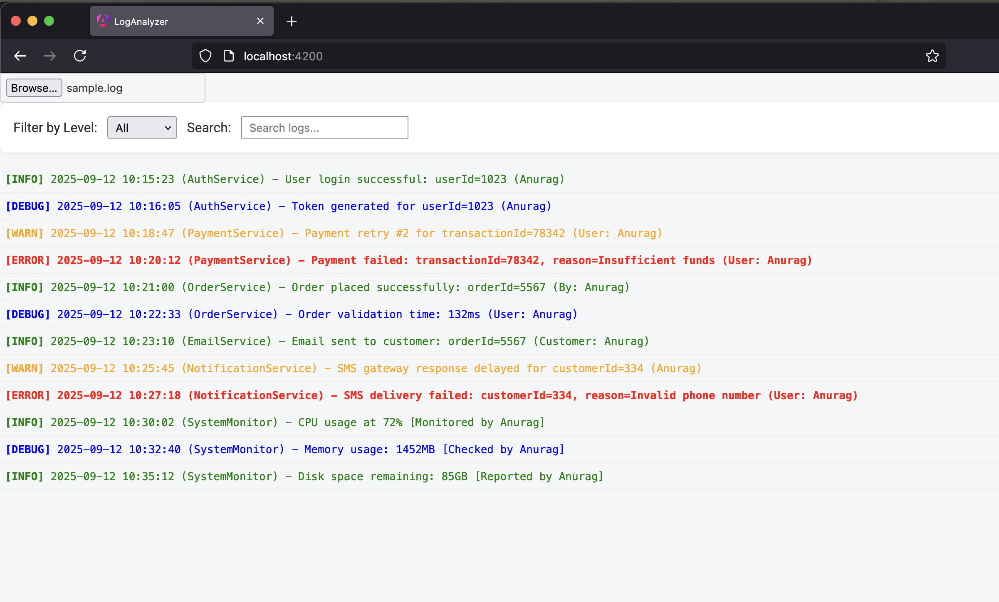
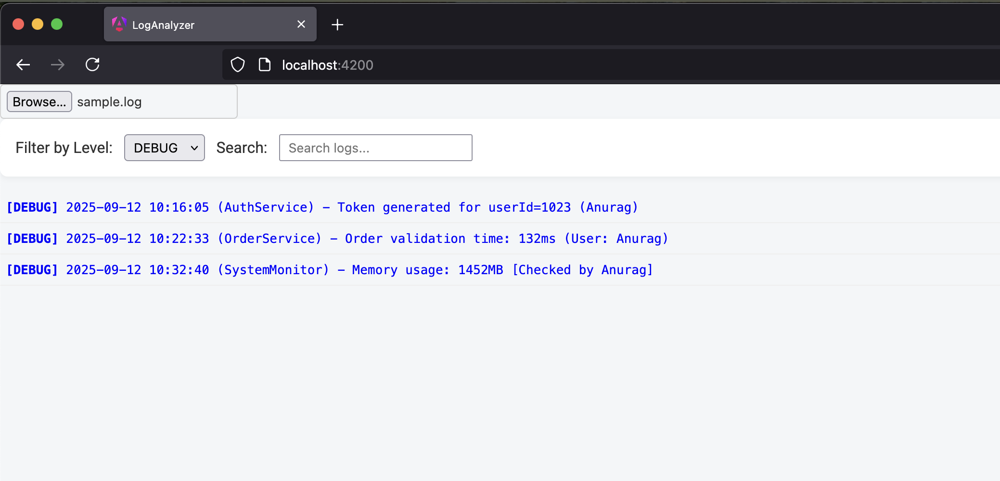
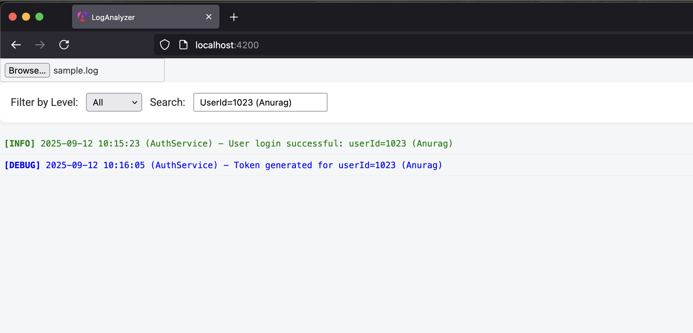

# 📊 Angular Log Analyzer

A simple **log analyzer built with Angular (standalone components)**.  
It allows you to **upload log files**, parse them into structured entries, and filter/search through them with a clean UI.

No backend required — everything runs in the browser.

---

## 🚀 Features

- Upload `.log` or `.txt` files and parse logs into structured objects.
- Detects **timestamp**, **level** (`INFO`, `DEBUG`, `WARN`, `ERROR`), **source** (if available), and **message**.
- Real-time filtering:
  - By **log level** (INFO, DEBUG, WARN, ERROR, or ALL).
  - By **search keyword** (message, source, level, or timestamp).
- Displays:
  - 📑 **Log Viewer** (wrapper for log filtering + list).
  - 📜 **Log List** (detailed view of logs).
  - 📈 **Log Stats** (counts by level).
- Uses **RxJS streams** for reactive updates.
- Written in **Angular 20 standalone components** (no NgModules).
- Angular Material used for UI
  **➡️ TODO:** Material theming is currently not applied — needs fixing in styles configuration.

---

## 📦 Prerequisites

- [Node.js](https://nodejs.org/) **v18+**
- [Angular CLI](https://angular.dev/tools/cli) **v16+**

Check versions:

```bash
node -v
npm -v
ng version

🛠 Setup

1️⃣ Clone the repository
    git clone git@github.com:anuragbiradar2305/log-analyzer.git
    cd log-analyzer

2️⃣ Install dependencies
    npm install

3️⃣ Run App
    ng serve

---

## 📸 Screenshots

Here’s how the Log Analyzer UI looks:

### Index Page


### Upload and View Log file


### Filter by level (DEBUG Filter applied here)


### Search by keyword (UserId=1023 (Anurag)


```
